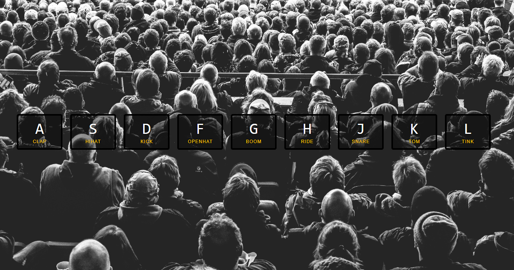
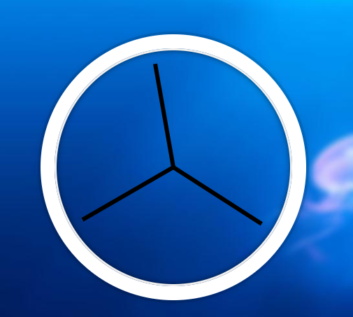
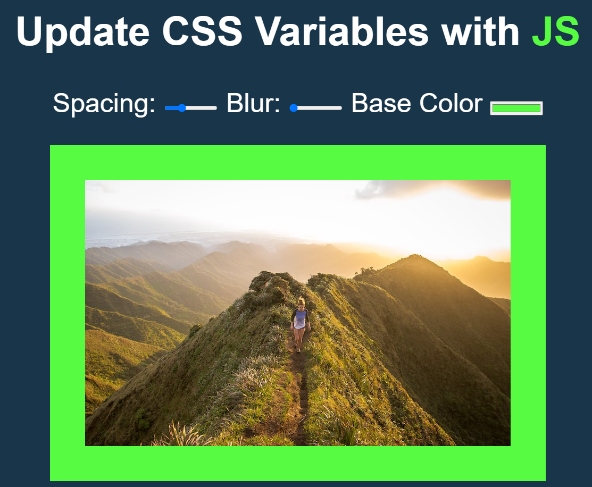

Задания по нативному JS. Суть курса состоит в том, что каждый день на протяжение 30 дней будут давать таски, объясняя в чем состоит задача, а потом их реализация. Моя цель - все это изучить за 13-15 дней. 

 

День №1: Drum Kit

- Работать с аудио (сделать логику для воспроизведение и остановки звуков)
- Научится обращаться к data-key и key-kode => [data-key="${event.keyCode}"]
- Добавить анимацию при клике и отключить его через некоторое время

 День №2: JS and CSS clock 

- Сделать так, чтобы настенные часы, а именно стрелки были направлены на 12 часов дня в CSS
- В Js прописать логику движение часов по часовой стрелке. 

День №3: Playing with CSS Variables and JS

- Научиться пользоваться переменными в CSS, и понять как они работают
- Написать логику в JS - для насыщенности, размытости и отступа.

День №4: Cardio

Решение задач по методам массивов: .filter(); .map(); .sort(); .reduce();  .findIndex(); .some(); .every(); .find(). Данные задачи расчитаны на два дня.

День №5: Flex Panels Image Galery

-
-
-

